# Mugify felhasználói útmutató

*Készítette: Györffy Dániel Programtervező informatikus hallgató*

> Az alkalmazás az Objektumorientált Programozás (GKNB_MSTM070) nevű tárgy félévi követelményeként készült ([sze.hu/~pusztai](http://www.sze.hu/~pusztai/)).

## Rövid ismertető

A ***Mugify*** egy bögre-tervező program, aminek a segítségével egy bögrét lehet testreszabni.

A bögrét, amit szerkesztünk meg lehet tekinteni **felülnézetben**, **oldalnézetben**, **alulnézetben**, sőt
egy **3D-ben forgatható változatban** is. Természetesen a munkáinkat tudjuk menteni (`.mugify` kiterjesztésű) fájlokba,
amiket később bármikor újra megnyithatunk.

Amikor a program elindul, egy kiinduló bögre példány már rendelkezésre áll, amit a `Bögre szerkesztő panel` segítségével
ízlésünk szerint alakíthatunk. Van lehetőség **új, véletlenszerű bögrék generálására** is, ha úgy kívánjuk.

### Az alkalmazás felületének struktúrája

A grafikus felület az alábbi fő részekből áll:
* (**1**) Menüsáv (legfelül)
* (**2**) Felső eszköztár (közvetlenül a menüsáv alatt)
* (**3**) "Bögre tulajdonságai" panel (bal oldalon) 
* (**4**) "Bögre szerkesztő" panel (jobb oldalon)
* (**5**) A bögre tekintő felület (középen) 
* (**6**) Alsó eszköztár

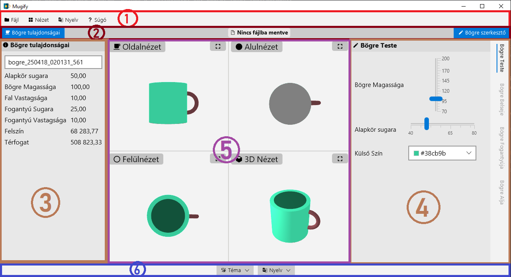

### Felhasználói felület témái

Az alkalmazás rendelkezik **világos** és **sötét** móddal is. Sőt, arra is van lehetőség, hogy az alkalmazás felülete
igazodjon az operációs rendszeren beállított felhasználói témához.

Ez azonkívül, hogy felhasználó-barátabbá teszi a programot, egy olyan gyakorlati haszonnal is rendelkezik, hogy ha 
olyan szín(eke)t állítunk be a bögre példányunknak, ami nem jól látszik az adott módban ("beleolvad" a környezetbe), akkor van lehetőség a másik módra átváltani.

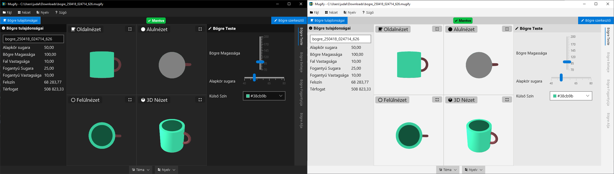

Következőképpen tudjuk ezeket a módokat váltogatni:
1. Menüsávból: `Nézet` > `Téma` > `Sötét`/`Világos`/`Szinkronizálás az op.rendszerrel`
    - 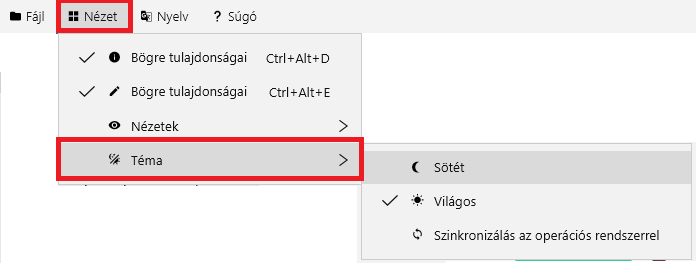
2. Vagy az alsó eszköztárból:
    - 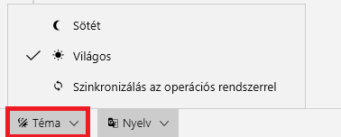

### A felhasználói felület nyelve

A program úgy lett megírva, hogy több nyelvet is tudjon támogatni.
Demonstrációként a program támogatja a magyar nyelven kívül az angol nyelvet is.

Következőképpen tudjuk a nyelveket váltogatni:
1. Menüsávból: `Nyelv` > `angol`/`magyar`
    - 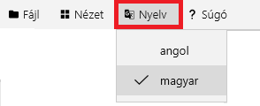
2. Vagy az alsó eszköztárból:
    - 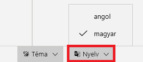

Amint valamelyik nyelvre átváltunk, a felület azonnal frissül a kívánt nyelvre.

## A bögre szerkesztése

A Mugify lehetővé teszi a bögrék teljes körű testreszabását az alábbi tulajdonságok beállításával:

**Bögre teste**
- **Magasság**: A bögre függőleges méretének beállítása.
- **Alapkör sugara**: A bögre alapkörének sugara, amely a test szélességét határozza meg.
- **Külső szín**: A bögre külső felületének színe.

**Bögre belseje**
- **Falvastagság**: A bögre falának vastagsága.
- **Belső szín**: A bögre belső üregének színe, amely külön testreszabható a valósághű hatás érdekében.

**Bögre fogantyúja**
- **Fogantyú sugara**: A bögre falának felétől mért távolság, amely a fogantyú félkörének teljes körre kiegészített sugarát jelenti.
- **Fogantyú lekerekítése**: A fogantyú formája szögletes (görbített, négyzet alapú hasáb) vagy lekerekített (görbített henger) lehet, ami a 3D nézetben mutatkozik meg igazán.
- **Fogantyú vastagsága**: Ha a foganytú formálya szögletes, ez a "görbítet hasáb" alapnégyzetének oldalhosszát jelenti, ha pedig a fogantyú formálya kerekített, akkor a "görbített henger" alapkörének átmérőjét jelenti.
- **Fogantyú színe**: A fogantyú színe, amely független a bögre testétől.

**Bögre alja**
- **Alj színe**: A bögre aljának egyedi színe.

_**A számértékű tulajdonságokat csak olyan határok között engedi mozgatni a program, hogy a megfelelő arányok ne sérüljenek.**_

> A bögre fogantyújának maximális értéke például erősen függ a fogantyú magasságától (értelemszerűen). Ezért
a program ezt nem egendi túlméretezni. Ha pedig a bögre magasságát csökkentjük, fogantyú sugara is vele együtt csökken, ha szükséges.

A bögre jellemzőit a `Bögre szerkesztő panel` segítségével lehet állítani/módosítani, ami a jobb oldalon található:  
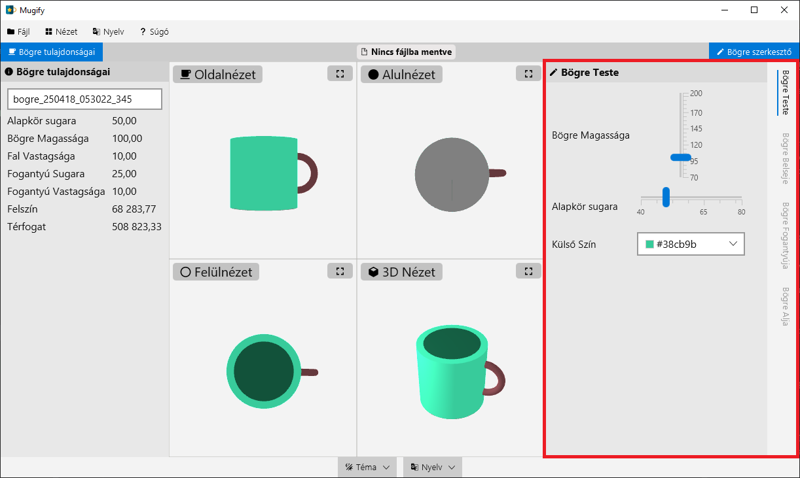

A szerkesztő panelen belül legszélen jobboldalt találhatóak a különböző fülek, amelyek csoportosítják a 
bögre tulajdonságait (bögre teste, bögre belseje, stb.), ezekre katintva tudjuk elérni az adott 
"kategóriához" tartozó tulajdonságokat:  
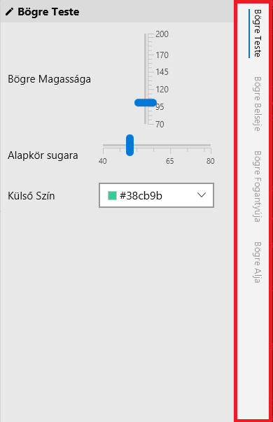

A bögre számértékű tulajdonságai csúszkákkal állíthatók, a színek pedig színválasztó dialógusokkal.  
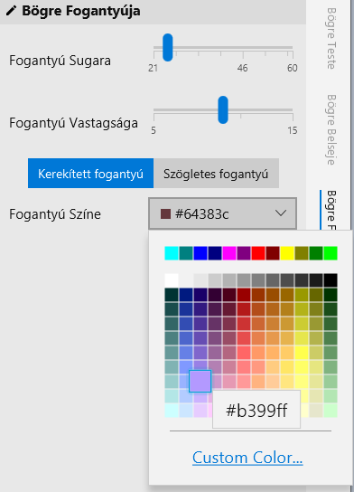

> _Ha a felhasználó ugyanazt a színt választja a bögre külsejének és a belsejének is, a program
> egy kis árnyalattal megváltoztatja a belső színt, hogy "ne olvadjon" egybe a bögre külseje és belseje, hanem egyértelműen
> meg lehessen különböztetni a bögre falát a bögre belsejétől!_

A Bögre szerkesztő panel egyébként elrejthető a felső eszköztár jobb oldalán található gombbal:  
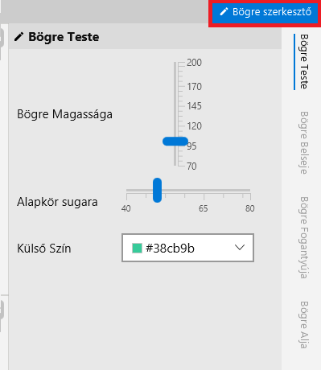

Ez jól jöhet akkor, ha a felhasználó több helyet akar hagyni a bögre nézegető térnek. A gombra való újbóli kattintásra
természetesen a panel újra visszahívható.

## A bögre tulajdonságainak megtekintése
A baloldalon található `Bögre tulajdonságai panel` a bögre jellemzőit mutatja meg összegezve.
Itt tudjuk szövegszerűen elolvasni, hogy pontosan milyen értékeket is állítottuk be a `bögre szerkesztő`-ben
lévő csúszkákkal:  
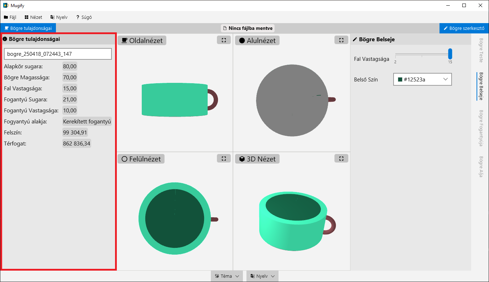

Itt megtalálhatóak a bögre felszínének és térfogatának a közelítő értékei is:  
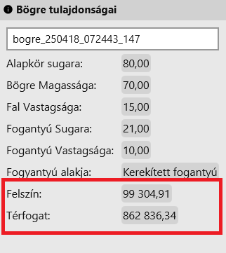

Az alábbiakban megismerkedhetünk azzal, hogy a program milyen számolási menettel dolgozik:
#### A bögre térfogatának számítása:
- A bögre térfogata a test és a fogantyú térfogatának összege.
- **_Test térfogata_**
  - A bögre teste olyan, mint egy üreges henger:
    - **Külső henger**: `sugár² × π × magasság`
    - **Belső henger**: `(sugár - 2 × falvastagság)² × π × (magasság - falvastagság)`
  - **Térfogat**: `Külső henger - Belső henger`
- **_Fogantyú térfogata_**
  - A fogantyú egy ívelt darab, aminek térfogata:
  - **Alap területe**:
     - Ha lekerekített: `(fogantyú_szélesség / 2)² × π`
     - Ha szögletes: `fogantyú_szélesség²`
  - **Ívhossz**: `fogantyú sugara × π`
  - **Térfogat**: Alap területe × Ívhossz
- **A bögre térfogata**: `test térfogata + fogantyú térfogata`

#### A bögre felszínének számítása:

A felszín a test felszínének és a fogantyú palást-felszínének összegéből áll, **de a fogantyú csatlakozási pontjait levonjuk**.

- **A test felszíne** több részből tevődik össze:
  - **Külső palást**: `2 × π × sugár × magasság`
  - **Belső palást**: `2 × π × (sugár - 2 × falvastagság) × (magasság - falvastagság)`
  - **Alsó külső alap**: `sugár² × π`
  - **Alsó belső alap**: `(sugár - 2 × falvastagság)² × π`
  - **A fal vastagságából adódó felszín (a bögre "pereme")**: `(külső alap - belső alap)`
  - Összeadjuk ezeket, hogy megkapjuk a test teljes felszínét.

- **A fogantyú felszíne:**
  - **Alap kerülete**:
     - Ha a fogantyú lekerekített: `2 × (fogantyú_szélesség / 2) × π`
     - Szögletes: `4 × fogantyú_szélesség`
  - **Ívhossz**: `fogantyú sugara × π`
  - **Felszín**: `Kerület × Ívhossz`
- **A bögre felszíne**: `test felszíne + fogantyú felszíne - 2 * fogantyú alapja`
  (A fogantyú alapjának területét kétszer levonjuk, mert a csatlakozási pontok nem részei a felszínnek.)

### A bögre neve
Ugyanitt, a `Bögre tulajdonságai panel`-ben lehet a bögrét elnevezni. Erre használható a panel tetején lévő szövegmező:
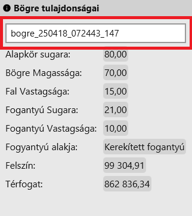

A program automatikusan generál egy nevet a bögrének (az aktuális dátum és idő alapján), ez a név
lesz automatikusan fájlnévként felajánlva a bögre fájlba való mentésekor (természetesen a fájlnak bármilyen más nevet is adhatunk).

> Megjegyzés: a bögre neve akkor is el lesz mentve, ha a fájlnév és az itt megadott név eltérő.

## A bögre nézetek

A bögrének 4 féle nézete van:

-  Oldalnézet: a bögrét oldalról mutatja be
-  Alulnézet: a bögrét alulról mutatja be
-  Felülnézet: a bögrét felülről mutatja be
-  3D nézet: **a bögrét 3D-s térben lehet a kurzorral mozgatni**

Alapértelmezetten az alkalmazás mind a négy nézetet mutatja egyszerre:  
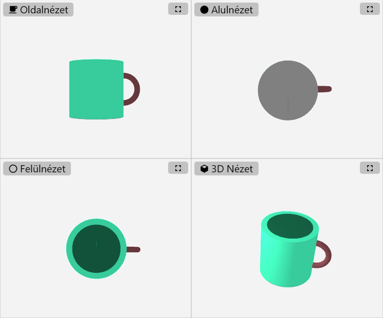

- Mindegyik nézet jobb felső sarkában van egy gomb (), aminek segítségével ki lehet nagyítani az adott nézetet.
- A nézetek váltogathatók a menüből is:   `Nézet` >  `Nézetek` > ...  

- Valamint billentyűkombinációkkal:  

| Nézet        | Billentyűkombináció |
|--------------|---------------------|
| Oldalnézet   | `CTRL + F1`         |
| Felülnézet   | `CTRL + F2`         |
| Alulnézet    | `CTRL + F3`         |
| 3D nézet     | `CTRL + F4`         |
| Összes nézet | `CTRL + F5`         |